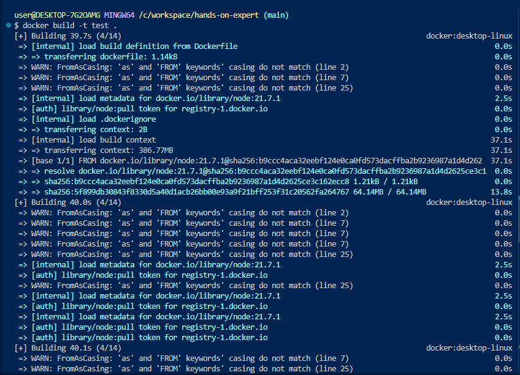
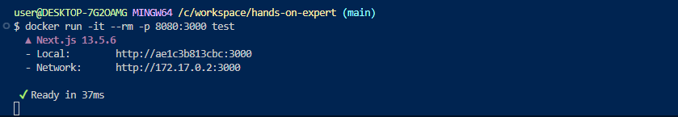
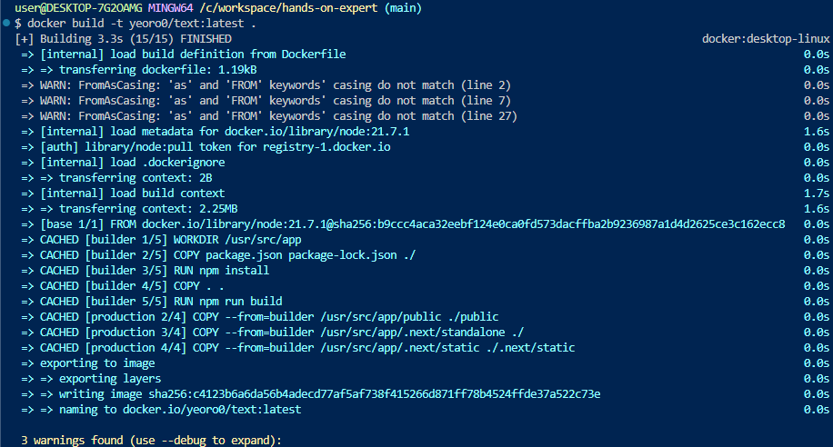
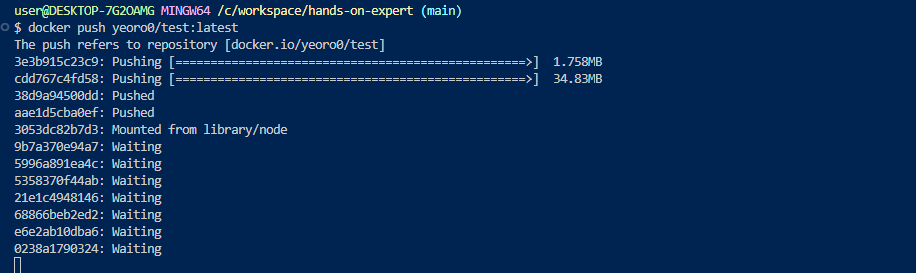
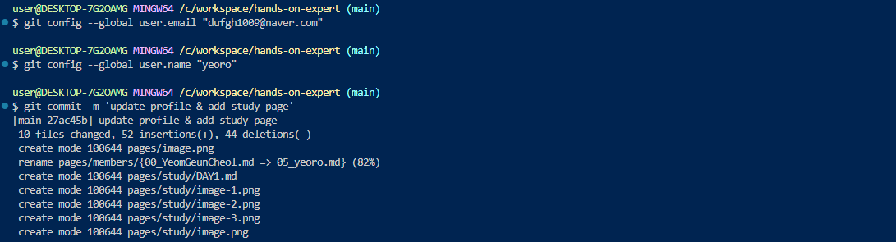

`docker build -t test .`

`docker run -it --rm -p 8080:3000 test`
- -p 8080:3000 : 컨테이너 내부의 3000 포트와 localhost의 8080 포트를 연결
- test : 도커이미지

- docker run 실행이 된다는 것은, docker가 설치된 어떤 환경에서든 실행할 수 있다는 의미

`docker build -t yeoro0/test:latest`

`docker push yeoro0/test:latest`

`git config global user.email`
`git config global user.name`
`git commit -m ''`
