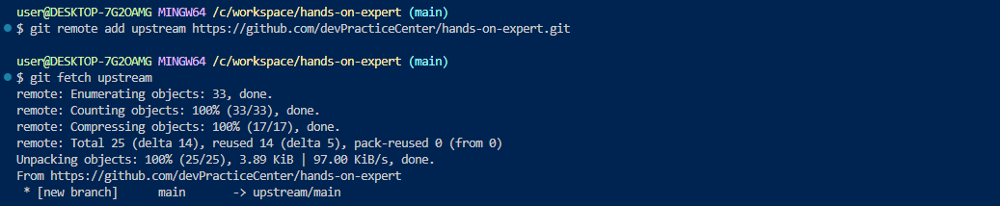
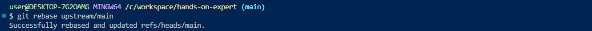
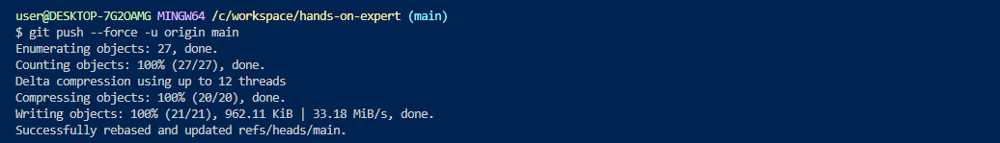

### 원본 원격 repo에서 업데이트 받아오기
`git remote add upstream [주소]`
`git fetch upstream`

`git rebase upstream/main`

`git push --force -u origin main`

#### HealthCheck
- deployment 단계에서 설정 (liveness, readiness)
- argo에서는 별도로 하진 않음